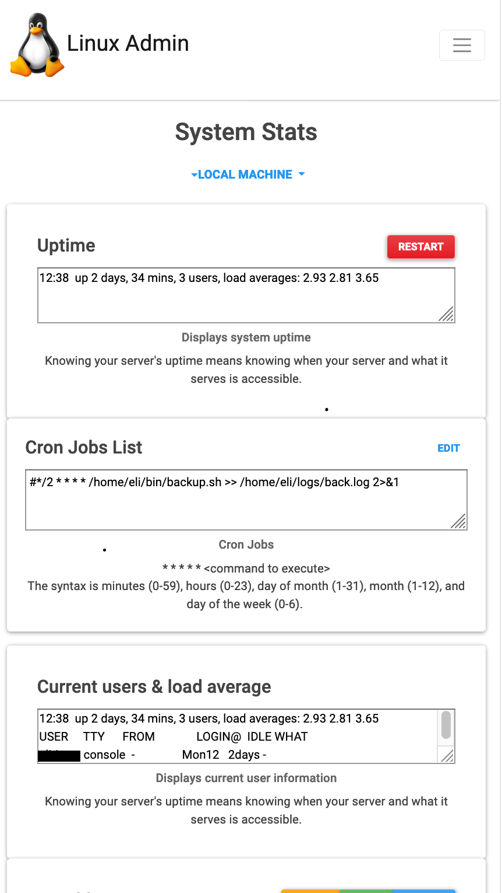

# Linux-Admin-Dash

Program will give the user system statistics information. Each piece of information is separated so that it is easier to read.
The other tabs will allow for viewing and editing cron jobs and database information. 

To run:
    1)Download folder
    2)Run app.py with python3
    3)open browser to <strong>localhost:5000</strong>

## The overview shows a nice and clean responsive display. 

Information about users, IP addresses, disk space, processes and environment variables can are displayed. 

 

## The web application is responsive so it will work with different screen sizes.

## Cron jobs

    <h3>The application will allow the user to visually:</h3> 	
	 <h4>Create Cron Job</h4>
	<h4>Backup Cron Jobs</h4>
	<h4>Import Cron Jobs</h4>
	<h4>Export Cron Jobs</h4>
	<h4>Edit Cron Jobs</h4>
	<h4>Stop Cron Jobs</h4>
	<h4>Delete Cron Jobs</h4>

## Future Work

 
All buttons need to be wired. I will have a modal display for the submitting and confirming input and commands when a button is clicked. The cronjobs page is just the UI. Also, remote connectivity and remote machine control will be added to allow for remote administration.
   
   -Add a place for launchctl -list for apple machines
   -Add a place for systemctl --type=service for linux machines
   -Add a place for iostat
   -Add a place for free (memory)
   -Add a place for network monitoring
  

