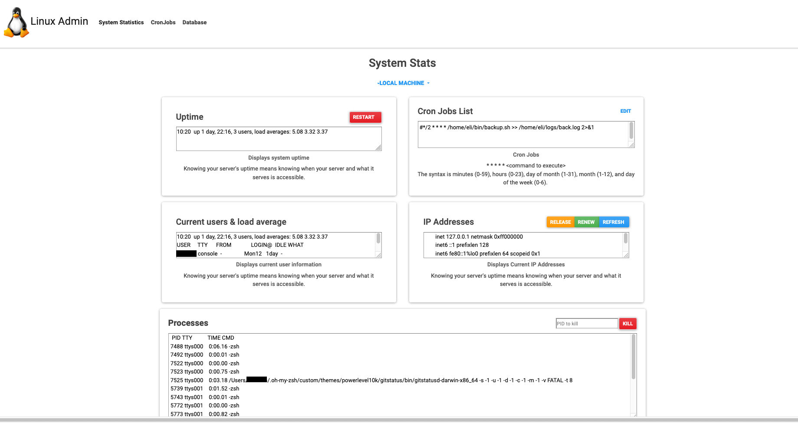
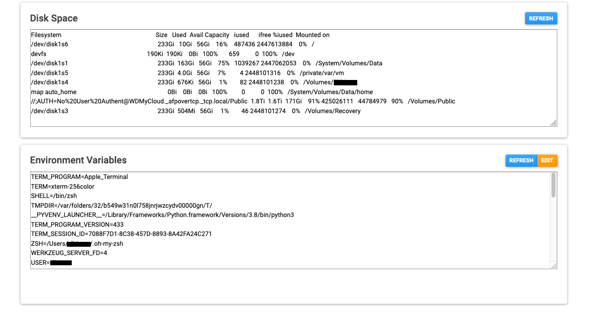
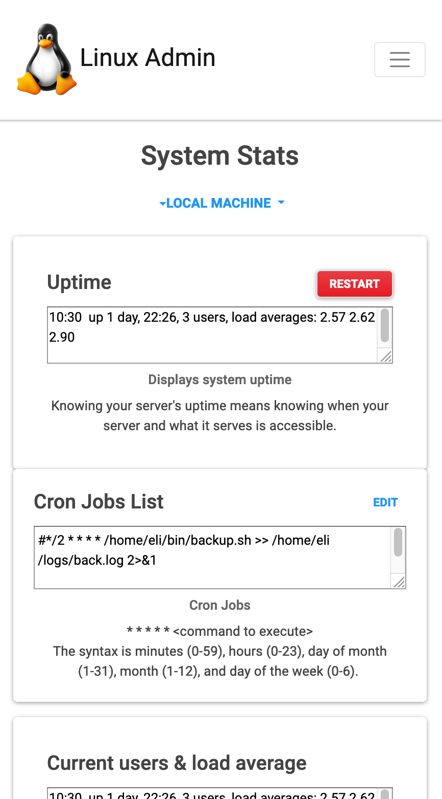

# Linux-Admin-Dash

Program will give the user system statistics information. Each piece of information is separated so that it is easier to read.
The other tabs will allow for viewing and editing cron jobs and database information. 

To run:
    1)Download folder
    2)Run app.py with python3
    3)open browser to <strong>localhost:5000</strong>

Information such as currently running processes and the environment variables are shown. 

The web application is responsive so it will work with different screen sizes.
Menu opens up to reveal links. 

## Future Work

 
Also, remote connectivity and remote machine control will be added to allow for remote administration. 
   
   -Add a place to kill a pid with output display
   -Add a place for launchctl -list for apple machines
   -Add a place for systemctl --type=service for linux machines
   -Add a place for iostat
   -Add a place for free (memory)
   -Add a place for network monitoring
  

