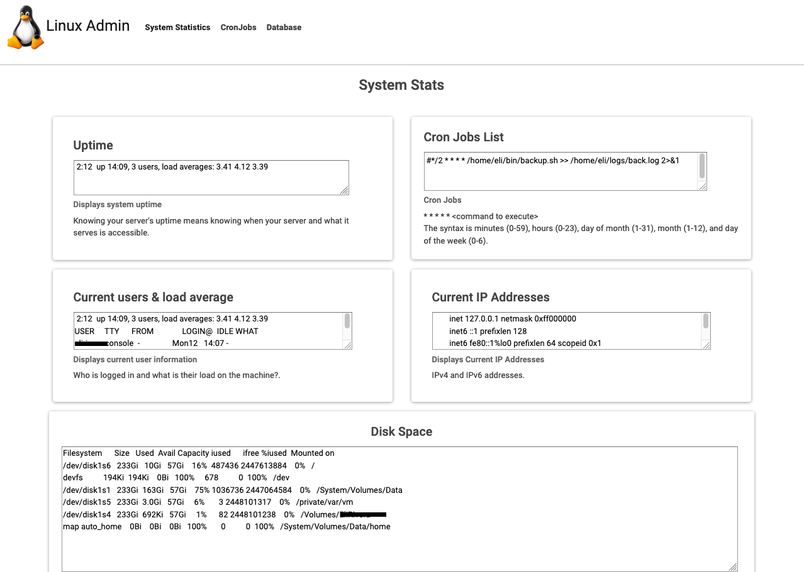
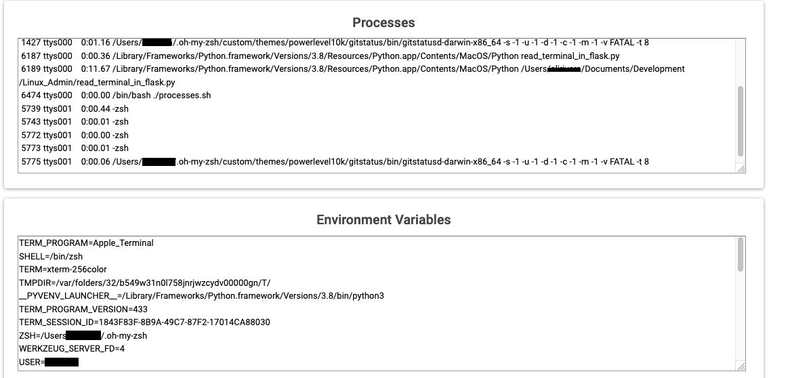

# Linux-Admin-Dash

Program will give the user system statistics information. Each piece of information is separated so that it is easier to read.
The other tabs will allow for viewing and editing cron jobs and database information.. 

Important information such as currently running processes and the environment variables are shown. 

## Future Work

Future work will include an edit and save button next to certain items so that config can be changed. 
Also, remote connectivity and remote machine control will be added to allow for remote administration. 

