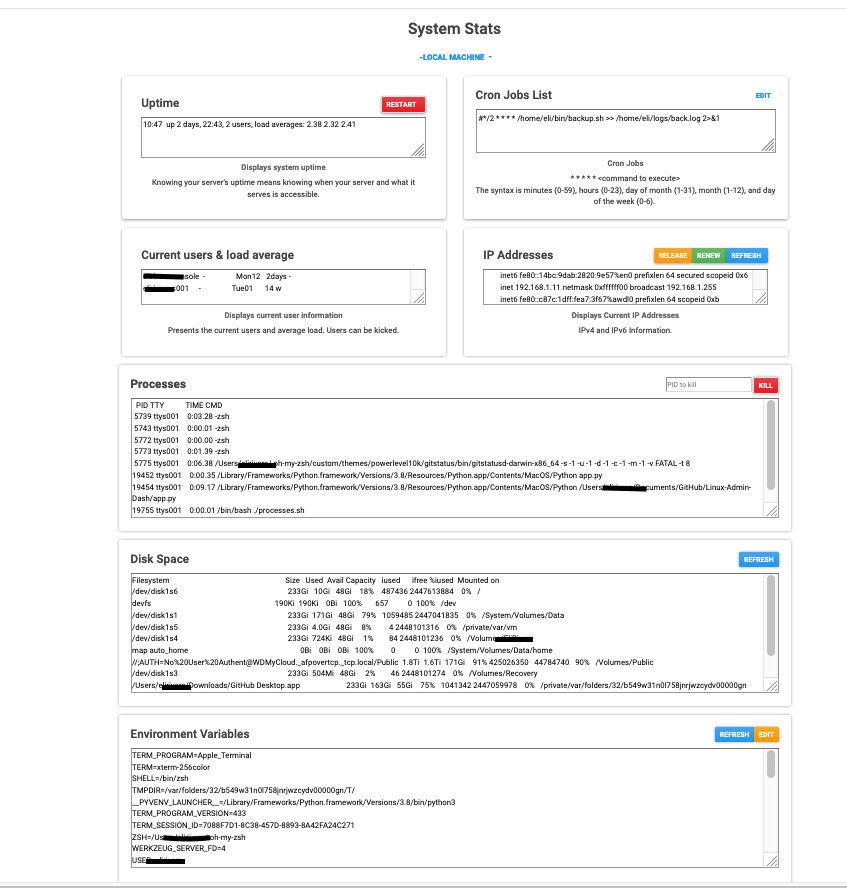
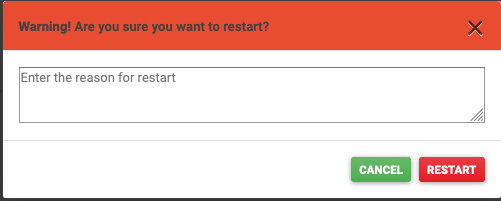
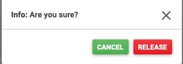
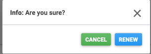

# Linux-Admin-Dash

Program will give the user system statistics information. Each piece of information is separated so that it is easier to read.
The other tabs will allow for viewing and editing cron jobs and database information. 

To run:
    1)Download folder
    2)Run app.py with python3
    3)open browser to <strong>localhost:5000</strong>

# System Statistics Page

### The overview shows a nice and clean responsive display. 

Information about users, IP addresses, disk space, processes and environment variables can are displayed. 

 

### Modals for confirmation and setting changes. 

When you press the <strong>restart</strong> button.
 

  When you press <strong>release</strong> IP

  When you press <strong>renew</strong> IP

  When you press <strong>kill</strong> to kill a process

# Cron jobs

  <h3>The application will allow the user to visually:</h3>

  <h4>Monitor existing cron jobs</h4>	
  
	<h4>Create Cron Job</h4>
  
	<h4>Backup Cron Jobs</h4>
  
	<h4>Import Cron Jobs</h4>
  
	<h4>Export Cron Jobs</h4>
  
	<h4>Edit Cron Jobs</h4>
  
	<h4>Stop Cron Jobs</h4>
  
	<h4>Delete Cron Jobs</h4>
  

# Future Work

 
 I will have a modal display for the submitting and confirming input and commands when a button is clicked. 
   Remote connectivity and remote machine control will be added to allow for remote administration.
   -Unified color pallete.
   -Add a place for launchctl -list for apple machines
   -Add a place for systemctl --type=service for linux machines
   -Add a place for iostat
   -Add a place for free (memory)
   -Add a controls for disk work in disk space section.
   -Add a place for network monitoring
   -Add logging.
   -Add settings page
   Home page
  

